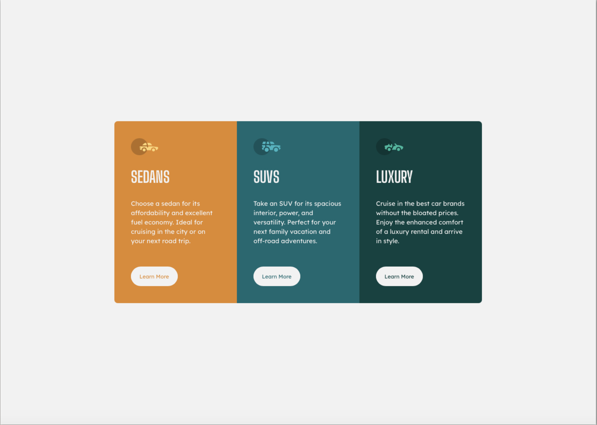
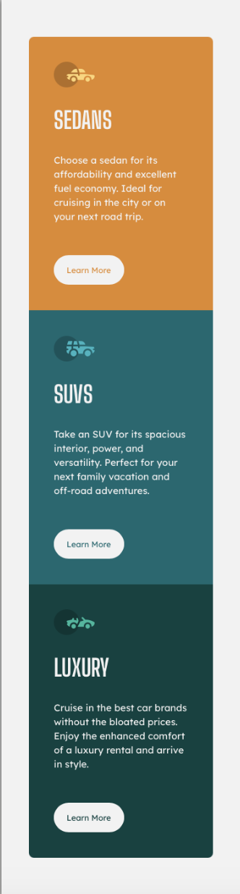

# Frontend Mentor - 3-column preview card component solution

This is a solution to the [3-column preview card component challenge on Frontend Mentor](https://www.frontendmentor.io/challenges/3column-preview-card-component-pH92eAR2-).

## Table of contents

- [Overview](#overview)
  - [The challenge](#the-challenge)
  - [Screenshot](#screenshot)
  - [Links](#links)
  - [Built with](#built-with)
- [Author](#author)

## Overview

### The challenge

Users should be able to:

- View the optimal layout depending on their device's screen size
- See hover states for interactive elements

### Screenshots

### Links

- Solution URL: [Solution URL](https://www.frontendmentor.io/solutions/3colpreviewcardcomponent-using-css-flexbox-5695IlDUBT)
- Live Site URL: [Live site URL](https://dashaunn.github.io/FEM-3-column-preview-card-component-main/)

### Built with

- Semantic HTML5 markup
- CSS custom properties
- Flexbox

## Author

- GitHub - [Dashaun](https://github.com/dashaunn)
- Frontend Mentor - [@dashaunn](https://www.frontendmentor.io/profile/dashaunn)
